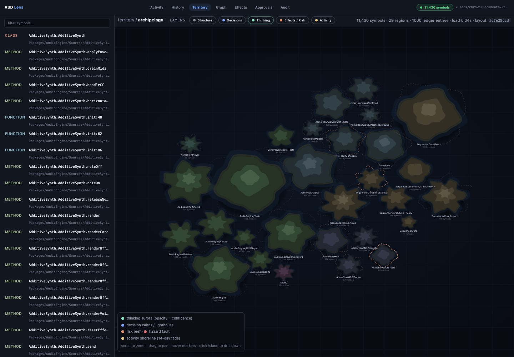
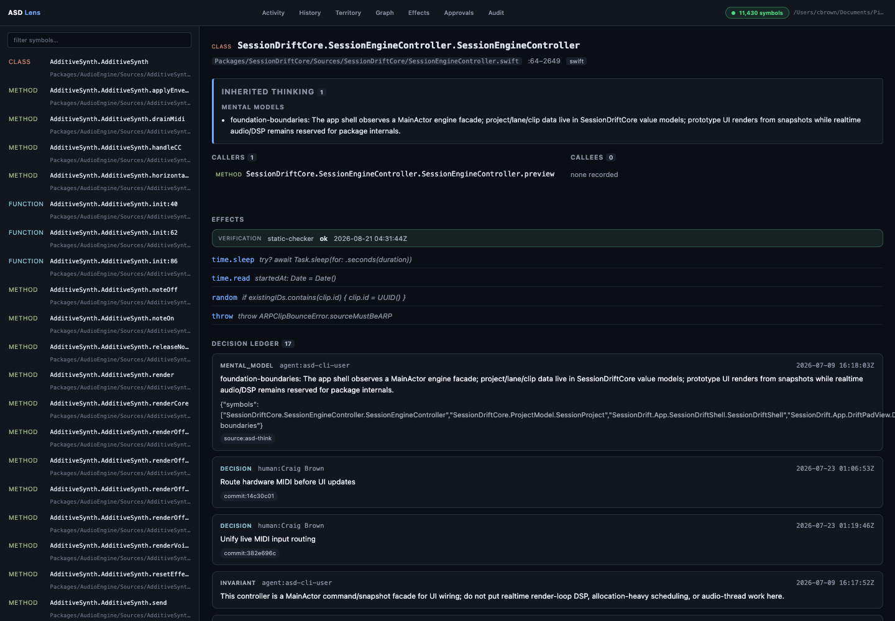
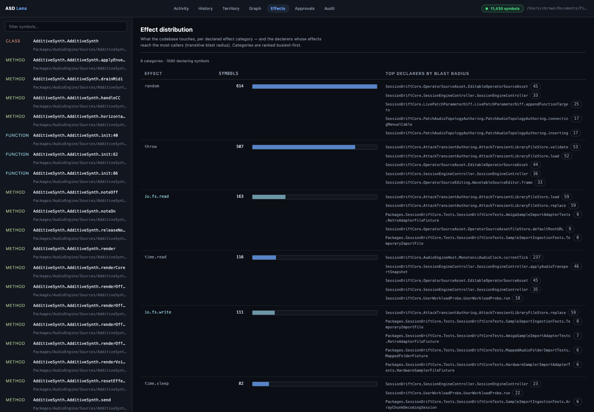

# AgentStateDeveloper

Code-level context and audit overlay for agent-authored code.

ASD gives every function a decision ledger, an effect declaration, and a
call graph — all queryable by the coding agents that write the code, and
all checked into git so they travel with every clone.

**Part of a suite:** ASD (per-developer code context) pairs with
**[CTXone](https://github.com/ctxone/ctxone)** (shared team memory). Installing
either offers the other — see [Pairs with CTXone](#pairs-with-ctxone).



## Install

### macOS / Linux — Homebrew (recommended)

```bash
brew tap agentstatelabs/agentstatedeveloper
brew trust agentstatelabs/agentstatedeveloper   # one-time, third-party-tap trust
brew install asd
```

Installs `asd`, `asd-mcp`, and `asd-serve`. Upgrades via `brew upgrade asd`.

> Recent Homebrew requires explicit `brew trust` for third-party taps.
> If you skip the trust step you'll see `Warning: Skipping … because it
> is not trusted` on `brew update` — the install will still succeed
> until then, but updates are silent no-ops.

### macOS / Linux — one-liner

```bash
curl -fsSL https://raw.githubusercontent.com/agentstatelabs/AgentStateDeveloper/main/install.sh | sh
```

Drops the three binaries in `~/.local/bin`. Optional overrides:
`ASD_VERSION=v1.3.1`, `INSTALL_DIR=/usr/local/bin`.

### Windows — PowerShell

```powershell
iwr https://raw.githubusercontent.com/agentstatelabs/AgentStateDeveloper/main/install.ps1 | iex
```

Installs `asd.exe`, `asd-mcp.exe`, and `asd-serve.exe` to
`%LOCALAPPDATA%\asd\bin` and adds it to your user `PATH`. Open a fresh
PowerShell after the install so the new PATH takes effect.

> Windows binaries are built for `x86_64-pc-windows-msvc`. ARM64 Windows
> isn't a release target yet — the x86_64 binaries run under Windows
> ARM emulation in the interim.

### From source (Rust toolchain required)

```bash
cargo install --path crates/agentstatedeveloper-cli   # installs asd
cargo install --path crates/agentstatedeveloper-mcp   # installs asd-mcp + asd-serve
```

> **Note:** the crate name `asd` on crates.io is taken by an unrelated diff tool.
> Install from source using the commands above.

### Uninstall

```bash
curl -fsSL https://raw.githubusercontent.com/agentstatelabs/AgentStateDeveloper/main/uninstall.sh | sh
# or:
brew uninstall asd
```

## What it does

| Primitive | What you get |
|---|---|
| **Decision ledger** | Append decisions, hazards, rationale, and constraints to any symbol. Entries survive renames. Approve, reject, or withdraw. |
| **Effect declarations** | 17 categories (`io.fs.read`, `io.net.out`, `io.db.write`, …). Declared per symbol, propagated transitively through the call graph. |
| **Semantic index** | Every function, method, and class parsed by tree-sitter. 9 languages: Python, TypeScript, Rust, Go, Java, C#, Ruby, Kotlin, Swift. |
| **Call graph** | Intra- and cross-module edges. Transitive effects propagate automatically. |
| **Policy gate** | File-backed JSON rules: allow, deny, or require-approval per action and actor kind. |
| **Ratification** | Approve, reject, or withdraw ledger entries. Full approval workflow. |
| **Audit event stream** | Hash-chained JSONL log of every ledger mutation and policy evaluation. |
| **Git-native sidecar** | The committed, compact subset of ledger entries (decisions, hazards, recipes, mappings, classifications, follow-ups, agent thinking) lives in `.asd/conclusions/*.jsonl` — checked into git, travels with every clone. Kilobytes, not megabytes. |

## The Lens review UI

`asd-serve` ships a web UI for reviewing what ASD knows about your code — the same index and audit overlay your agents query, in the browser.

| | |
|---|---|
| [](docs/img/asd-lens-symbol.png) | [](docs/img/asd-lens-effects.png) |
| **Symbol detail** — callers/callees, static-checker-verified effects, and the full decision ledger, invariants, and inherited thinking for one symbol. | **Effect distribution** — per-category effect counts and the declarers whose effects reach the most callers (transitive blast radius). |

The [Territory](docs/img/asd-lens-territory.png) view above renders the whole codebase as a stable map; a [3D globe](docs/img/asd-lens-globe.png) variant paints the same layers on a planet for a hero-scale overview.

## Pairs with CTXone

ASD and **[CTXone](https://github.com/ctxone/ctxone)** are built as a suite:

- **ASD** — per-developer **code context**: the decision ledger, effect
  declarations, call graph, and impact analysis for the code in front of you.
- **CTXone** — the **team layer**: shared decisions, plans, and memory that
  travel across the whole team.

Each works standalone, but they're better together:

- Installing either one **offers to set up the other** — a one-time, dismissable
  nudge (suppress with `--no-nudge` or `ASD_NO_SUGGEST=1`).
- When both are installed, `asd skill` also installs a **combined suite skill**
  that teaches the agent the joint workflow: use ASD for the code specifics
  (impact, invariants), and record what you decide into CTXone so the team
  inherits it.
- `asd bootstrap` offers to install **both**.

## Quick start

```bash
# Clone and build
git clone https://github.com/agentstatelabs/AgentStateDeveloper.git
cd AgentStateDeveloper
cargo install --path crates/agentstatedeveloper-cli
cargo install --path crates/agentstatedeveloper-mcp

# Initialize your project (one-shot: init → index → conclusions import,
# in the right order — idempotent, safe to re-run)
cd my-project
asd onboard
# (or, step by step: asd init && asd index .)

# Read a symbol
asd read payments.chargeCard

# Append a ledger entry
asd ledger append payments.chargeCard \
  --kind hazard \
  --summary "fails silently above 10000 — caller must check return value" \
  --author-kind human \
  --author-id alice@example.com

# Register the MCP server with your agent tools
asd mcp install

# Export the committed sidecar and commit
asd conclusions export
git add .asd/conclusions/
git commit -m "chore: sync ASD sidecar"
```

(The `asd init` pre-commit hook runs `asd conclusions export` automatically;
the explicit two-step above is just to illustrate what's happening.)

### MCP ↔ CLI naming reference

ASD has two surfaces with two naming conventions: MCP uses a flat
namespace (`ledger_append`, `code_search`) so tools don't collide with
other MCP servers; the CLI nests (`asd ledger append`, `asd search`).
The canonical mapping lives in [docs/mcp-cli-mapping.md](docs/mcp-cli-mapping.md).
Both forms work on the CLI — agents trained on older MCP-era docs can
type either `asd ledger append` or (via clap aliases from Plan D t-003)
the equivalent `asd code_search` / `asd callers_of` etc.

### Brief output mode for agents

`asd` defaults to a verbose JSON shape that's helpful for humans and
structured-parsing pipelines but spends tokens an agent rarely needs.
Set `ASD_FORMAT=brief` (or pass `--brief` per-invocation) to project
`read` / `callers` / `callees` responses down to load-bearing fields
only (qname, file:line, signature, first doc line). Typical reduction:
60–80% on those commands.

Recommended once at process start for any agent that drives `asd`:

```bash
export ASD_FORMAT=brief
```

Applies to CLI and MCP. The spawned `asd-mcp` server inherits
`ASD_FORMAT=brief` from its parent process at startup and projects the
three highest-volume read tools (`code_read`, `code_search`,
`references`) through the same compact shape.

## Agent setup

ASD plugs into your coding agent in a few layers. The fastest path is to let the
agent set itself up.

### Paste-to-your-agent (recommended)

```bash
asd bootstrap
```

Prints a short block you paste into whatever agent you're already in (Claude
Code, Cursor, Codex, Gemini CLI, …). The agent then installs, indexes, and
connects ASD itself — and offers to set up **CTXone** (the team layer) too.

### Individual commands

| Command | Sets up |
|---|---|
| `asd mcp install` | Registers the `asd-mcp` stdio server in every detected agent's MCP config — Claude Code, Claude Desktop, Cursor, Codex, Gemini CLI, Windsurf, Zed, VS Code, Cline, Kilo Code, Antigravity, and more. Restart the tool to activate. |
| `asd skill` | Installs ASD's **Agent Skill** (`SKILL.md`) into each host's skills directory — teaches the agent *when* to reach for ASD. Version-stamped, and won't overwrite a newer on-disk skill. When the `ctx` CLI is present, it also installs the combined **ASD + CTXone** suite skill. |
| `asd mcp instructions` | Injects a managed always-on usage block into `AGENTS.md` / `CLAUDE.md` (idempotent — safe to re-run). |
| `asd watch` | Watches the repo and re-indexes on source changes, so the index never silently drifts. |

```bash
asd mcp status                 # registration status across all tools
asd mcp install --tool cursor  # one specific tool
asd mcp install --db /abs/db   # non-default db path
asd mcp uninstall              # remove from all tools

asd skill --status             # what's installed, per host
asd skill --dry-run            # preview without writing
```

The MCP server reads `ASD_DB` (set by `install` in the env block) so agents
always connect to the right project database.

### On-demand help for agents

`asd help` returns compiled-in feature docs (synopsis, syntax, params,
examples, gotchas) — version-pinned to the running binary, so the CLI and
the `asd-mcp` `help` tool return byte-identical payloads. An agent that hits
an unfamiliar feature can pull just that page instead of loading an
always-on instruction block.

```bash
asd help                 # full feature catalog
asd help impact          # one feature (also accepts a phrase, e.g. "blast radius")
asd help --agent         # machine-readable JSON
```

### Parallel agents — plan-scoped worktrees

`asd worktree` gives each unit of work its own git worktree + `plan/<name>`
branch, so parallel agents get isolated files and HEAD (they can't clobber
each other) while sharing context through the hub.

```bash
asd worktree start <plan>            # add ../<repo>-wt-<plan> on plan/<plan>
asd worktree list                    # this repo's plan-scoped worktrees and clones
asd worktree finish <plan> --push    # merge back, push, then tear down
```

`--shared-target` shares one Rust build cache across worktrees (avoids a
multi-GB `target/` per tree); `--clone` isolates via a fresh clone with its
own `.git` (for remote/cloud agents on another machine), merging back via
`origin` instead of a local merge.

## Git-native sidecar

ASD has two on-disk locations and one in-SQLite namespace. Knowing which
is which avoids surprise:

| Location | What's in it | Tracked in git? | Authoritative for? |
|----------|--------------|-----------------|---------------------|
| `.asd-state.db` | Live SQLite ASG (index, call graph, FTS, full ledger, traces) | **No** (gitignored) | Everything at runtime |
| `.asd/conclusions/*.jsonl` | Compact subset: decisions, classifications, mappings, hazards, recipes, follow-ups, agent thinking | **Yes** | What a fresh clone needs to inherit |
| `.asd/v1/` (legacy) | Older verbose mirror — superseded by `.asd/conclusions/` | **No** (gitignored) | Vestigial; `asd sync`/`asd hydrate` still write/read it for local debug. Not on the commit path. |

The principle: **the committed sidecar carries judgment** (decisions
the agent or human had to make). **Everything else is regenerable**
from source via `asd index .`, so it's gitignored.

**One-time setup:**

```bash
asd init
```

```
initialized at ./.asd-state.db
.gitignore: updated (.asd-state.db and .asd/v1/ ignored — both are local derived state)

ASD git hooks installed (.asd/hooks/):

  pre-commit    trigger:  git commit
                command:  asd conclusions export
                purpose:  write committed conclusions (decisions/hazards/recipes/…) to .asd/conclusions/*.jsonl

  post-merge    trigger:  git merge / git pull
                command:  asd conclusions import && asd index .
                purpose:  import committed .asd/conclusions/ into local ledger and rebuild index

  post-checkout trigger:  git checkout / git switch
                command:  asd conclusions import && asd index .
                purpose:  sync local db to the checked-out branch's sidecar state

  core.hooksPath → .asd/hooks  (hooks are now active)

  To skip hook installation: asd init --no-hooks
  To review hooks later:     asd hooks
```

After `asd init`, the pre-commit hook runs `asd conclusions export`
automatically on every commit — no manual steps.

**Onboarding after clone:**

```bash
git clone <repo>
cd <repo>
asd onboard               # one-shot: init → index → conclusions import
asd mcp install           # registers asd-mcp with your agent tools
```

`asd onboard` runs the right sequence for either a fresh repo or a fresh
clone, in the correct order, and is idempotent (safe to re-run). The
equivalent manual steps:

```bash
asd init                  # installs hooks, updates .gitignore
asd conclusions import    # loads .asd/conclusions/*.jsonl → local ledger
asd index .               # rebuilds derived semantic index from source
```

## Indexing

```bash
asd index .            # index current directory
asd index . --verbose  # show each file as it is processed, list skipped files
```

Standard output:
```
Indexing 42 files under . …
Done. 187 symbols, 187 effects. (12 files skipped — run with -v to list)
```

Unrecognized file types (`.yaml`, `.json`, `.md`, etc.) are silently skipped
in standard mode and listed with `[skip]` in `--verbose` mode. The `skipped`
count is always included in the JSON summary.

## Surfaces

- **`asd`** — CLI: orientation (`architecture`, `search`, `trust`, `map`), change-prep (`prepare-change`, `impact`, `checklist`, `since`, `investigate`, `annotate-commit`, `task-close`, `test-summary`), the ledger (`ledger`, `invariant`, `conclusions`, `scratch`, `think`), and plumbing (`onboard`, `init`, `index`, `sync`, `hydrate`, `audit`, `hooks`, `mcp`, `skill`, `watch`, `worktree`, `help`) — see [`asd --help`](docs/FEATURES.md) for the full set
- **`asd-mcp`** — stdio MCP server exposing 64 tools to coding agents
- **`asd-serve`** — HTTP server + Lens review UI

## MCP tools

Agents access ASD through **64 MCP tools** spanning code search/read, the call
graph, orientation (`architecture`, `trust`, `endpoints`, `dead_code`), impact
and change analysis, the decision ledger, invariants, effects, conclusions,
scratch notes, agent thinking, feedback, and audit — e.g. `code_search`,
`code_read`, `callers`, `callees`, `context_for`, `impact`, `prepare_change`,
`since`, `architecture`, `trust`, `ledger_append`, `invariant_add`,
`effect_declare`, `conclusions_export`, `scratch_write`, `think_speculate`,
`feedback_promote`, `audit_verify`, `reindex`, `help`. The full list is in
[docs/FEATURES.md](docs/FEATURES.md#mcp-tools).

## Documentation

**Get started:**
- [Walkthrough](docs/WALKTHROUGH.md) — install → daily loop → what happens under the covers → using ASD + CTXone together
- [Features & Command Reference](docs/FEATURES.md) — every command, primitive, and MCP tool, explained
- [Federation](docs/FEDERATION.md) — point ASD at multiple repos for cross-repo edges and decision-aware impact (`asd repo edges/impact`)

**Reference:**
- [MCP ↔ CLI mapping](docs/mcp-cli-mapping.md) — the two naming conventions, side by side
- [Repo registry](docs/repo-registry.md) — the shared multi-repo registry (`asd repo`)
- [Initial-read prompt](docs/initial-read-prompt.md) — the cold-start orientation prompt behind `asd think` / `asd map`
- [Pairing with RTK](docs/PAIRING_WITH_RTK.md)

**Licensing:**
- [Licensing](LICENSING.md) — BSL-1.1 in plain English

## License

ASD is the full per-developer engine: index, ledger, effects, call graph,
impact, invariants, in-repo cross-service edges, and agent onboarding.
Self-hosted, no account.

The code is licensed under **BSL-1.1** and converts to **Apache-2.0** four
years after each release — internal use is free. Full plain-English summary:
**[LICENSING.md](LICENSING.md)**.
